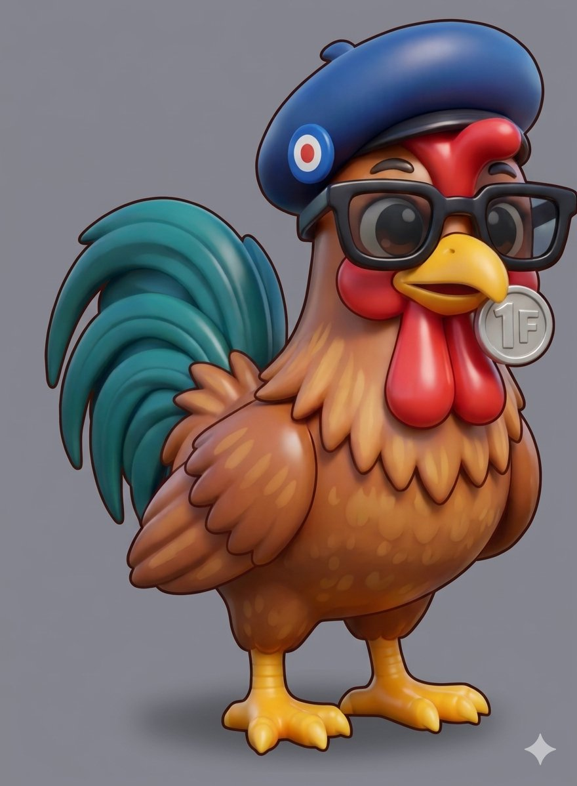

# 🐓 Francis le Coq — Tamagotchi Telegram Mini App

Un jeu Tamagotchi complet jouable directement dans Telegram ! Élève **Francis**, un coq gaulois avec son béret bleu, ses lunettes et sa pièce de 1 Franc.

<p align="center">
  
</p>

## 🎮 Fonctionnalités

- **5 stades d'évolution** : 🐣 Poussin → 🐤 Petit Coq → 🐔 Coq Ado → 🐓 Adulte → 👴 Vieux
- **4 statistiques** en temps réel : Faim, Bonheur, Énergie, Santé
- **6 actions** : Nourrir, Jouer, Dormir, Soigner, Nettoyer, Caresser
- **6 types de nourriture** avec effets variés
- **Mini-jeux** : Attrape-grains, Mémoire de coq
- **Cycle jour/nuit** automatique
- **Animations** : marche, manger, dormir, émotions, bulles de dialogue
- **Sauvegarde** via localStorage + Telegram CloudStorage
- **Telegram Mini App** : s'ouvre en plein écran dans Telegram

## 🚀 Déploiement

### Étape 1 : Héberger sur GitHub Pages

```bash
# Fork ou clone ce repo
git clone https://github.com/TON_USERNAME/francis-le-coq.git
cd francis-le-coq
git push origin main
```

Dans les **Settings** du repo GitHub → **Pages** → Source : `main` / `/ (root)`.

Ton jeu sera accessible à `https://TON_USERNAME.github.io/francis-le-coq/`

### Étape 2 : Créer le bot Telegram

1. Parle à [@BotFather](https://t.me/BotFather) → `/newbot`
2. Donne un nom (ex: `Francis le Coq`) et un username (ex: `FrancisCoqBot`)
3. Copie le **token**
4. Configure la Mini App : `/newapp` → choisis ton bot → envoie l'URL GitHub Pages

### Étape 3 : Lancer le bot

```bash
cd bot/
pip install python-telegram-bot

FRANCIS_BOT_TOKEN=ton_token \
FRANCIS_WEBAPP_URL=https://ton-user.github.io/francis-le-coq/ \
python bot.py
```

## 📁 Structure du projet

```
francis-le-coq/
├── index.html              # Page principale du jeu
├── css/
│   └── style.css           # Styles complets (scène, animations, UI)
├── js/
│   ├── storage.js          # Sauvegarde localStorage + Telegram Cloud
│   ├── engine.js           # Moteur de jeu (stats, évolution, actions)
│   ├── renderer.js         # Rendu visuel (scène, pet, effets)
│   ├── minigames.js        # Mini-jeux (tap, mémoire)
│   └── app.js              # Contrôleur principal
├── assets/
│   ├── sprites/            # Sprites du personnage
│   │   └── francis.png     # Image de Francis (stade adulte)
│   ├── backgrounds/        # Décors (à ajouter)
│   ├── items/              # Items : nourriture, jouets (à ajouter)
│   └── ui/                 # Éléments d'interface (à ajouter)
├── bot/
│   └── bot.py              # Bot Telegram (lance la Mini App)
└── README.md
```

## 🖼️ Ajouter des assets personnalisés

### Spritesheets par stade (optionnel)
Ajouter dans `assets/sprites/` :
- `francis_poussin.png` — Petit poussin
- `francis_petit.png` — Jeune coq
- `francis_ado.png` — Coq adolescent
- `francis_adulte.png` — Coq adulte (= `francis.png`)
- `francis_vieux.png` — Vieux coq sage

### Backgrounds (optionnel)
Ajouter dans `assets/backgrounds/` :
- `room_day.png` — Scène principale (jour)
- `room_night.png` — Scène principale (nuit)

Le jeu fonctionne avec des décors CSS par défaut si les images ne sont pas fournies.

## 🎯 Mécanique de jeu

| Mécanisme | Description |
|-----------|-------------|
| Déplétion | Les stats baissent en temps réel, même hors-ligne |
| Interactions | Un coq affamé perd santé et bonheur |
| Évolution | Temps écoulé + stats moyennes ≥ 25% |
| Cooldowns | Chaque action a un délai avant réutilisation |
| Poops | Apparaissent toutes les 2h, à nettoyer ! |
| Mort | Si 2+ stats tombent à 0 |

## 📄 Licence

Code : MIT License
Mécanique de jeu inspirée de [Tamaweb](https://github.com/autosam/Tamaweb) (CC BY-NC-SA 4.0 par SamanDev).

---

*Cocoricoooo ! 🐓🇫🇷*
