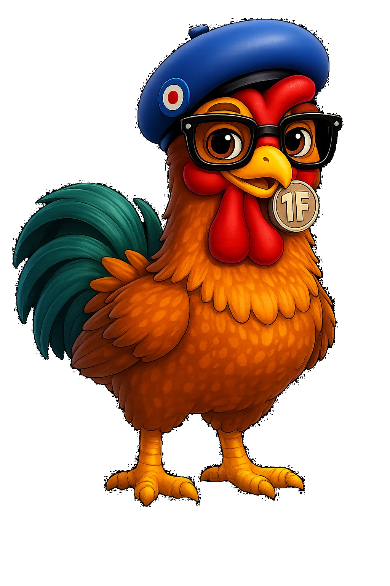

# 🐓 Francis le Coq — Tamagotchi Telegram Mini App

A full Tamagotchi-style game playable directly inside Telegram. Raise **Francis**, a French rooster with his blue beret, glasses and his 1-Franc coin — feed him, play with him, keep him healthy, watch him evolve, and survive random events.

<p align="center">
  
</p>

## 🎮 Features

- **5 evolution stages**: 🐣 Chick → 🐤 Little Rooster → 🐔 Teen Rooster → 🐓 Adult → 👴 Old
- **7 live stats**: Happiness, Hunger, Play, Energy, Health, Hygiene, Love
- **Care actions**: Feed, Play, Sleep, Cuddle, Heal, plus Toilet / Shower / Brushing
- **6 foods** with different effects
- **Mini-games**: Catch the grains, Catch the food, Roost Clicker, Tic-tac-toe, Mini Sudoku, Reading
- **Enclosure / farm**: buy hens, feed and clean the pen, collect eggs for coins
- **Random events** with timed choices: Foxes attack, Storm, Covid19 pandemic, Chantal's visit
- **Day / night cycle** and **weather** (sun, rain, clouds, moon) synced between the main scene and the enclosure
- **Housing upgrades**: Henhouse → Wooden house → Brick house → Castle → Palace → SpaceX
- **Bilingual**: English (default) / French, switchable instantly via flag buttons
- **$FRANC wallet gating**: connect a Solana wallet holding $FRANC to play unlimited
- **Save** via localStorage + Telegram CloudStorage

## 🌍 Languages

The game ships fully bilingual (English default / French). Players switch language with the 🇬🇧 / 🇫🇷 flag buttons on the splash screen; the whole UI, events, quests, journal, dialogue and mini-games refresh instantly. All strings live in `js/i18n.js` (a single dictionary with `en` / `fr` entries and a `t()` helper).

## 🔗 $FRANC wallet & unlimited mode

Wallet connection and $FRANC verification are handled by a **separate, shared web app** hosted in its own repository:

- Wallet app: `https://franclecoq.github.io/Wallet/connect-wallet.html` (repo `FrancLeCoq/Wallet`)
- Opened in-game as the Telegram mini-app `https://t.me/FrancisLeCoqBot/wallet`

> The wallet app is **not** part of this repository and must not be bundled here.

How it works in the game:
- A small padlock sits in the top bar, between the coins and the chick status.
  - **Closed padlock 🔒 (orange)** = no $FRANC detected.
  - **Open padlock 🔓 (green)** = $FRANC holder, unlimited mode unlocked.
- Tapping the padlock (or the splash holder badge) opens the wallet app. The Telegram back button returns to the game.
- The game calls the backend endpoint `POST /check-franc` with the Telegram `initData`, and re-checks automatically when the player returns to the game (visibility change) and every 20s.
- **With $FRANC** → unlimited play. **Without $FRANC** → the game ends after the Chick stage: the reaper appears and a bilingual message invites the player to connect a $FRANC wallet to unlock the holder features.

Backend (shared with the other Franc games): `https://mubqtnqulpyehkgubhnh.supabase.co/functions/v1`.

## 🎲 Random events

Events trigger during play, each with a ~10s intro animation, a choice, and a ~10s outcome animation:

- **Foxes** 🦊 — hide Francis and call the hunter (pay a −10% pot tax, coins fly away as he leaves) or risk it.
- **Storm** 🌪️ — tornadoes roam the whole screen with heavy rain; hide Francis or "learn to fly".
- **Covid19** 🦠 — red/blue siren décor and floating viruses; vaccinate (viruses fade out) or refuse.
- **Chantal's visit** 👩‍🌾 — hug her (hearts) or collect the eggs (coins); the animation runs until she leaves.

The **alarm sound** (`assets/sounds/alarme.mp3`) plays for the full duration of the Storm, Foxes and Covid19 events (when game sound is on).

## 🚀 Deployment

### 1. Host on GitHub Pages

```bash
git clone https://github.com/FrancLeCoq/tamagotchi.git
cd tamagotchi
git push origin main
```

In the repo **Settings → Pages → Source**: `main` / `/ (root)`.
The game will be served at `https://franclecoq.github.io/tamagotchi/`.

### 2. Create / configure the Telegram bot

1. Talk to [@BotFather](https://t.me/BotFather) → `/newbot` (or reuse `@FrancisLeCoqBot`).
2. Configure the Mini App: `/newapp` → choose the bot → set the GitHub Pages URL.
3. Make sure the Tamagotchi mini-app short name and the `/wallet` mini-app are both registered under the same bot so the wallet flow works.

### 3. Run the bot (optional helper)

```bash
cd bot/
pip install python-telegram-bot

FRANCIS_BOT_TOKEN=your_token \
FRANCIS_WEBAPP_URL=https://franclecoq.github.io/tamagotchi/ \
python bot.py
```

## 📁 Project structure

```
francis-le-coq/
├── index.html              # Main game page
├── css/
│   └── style.css           # All styles (scene, animations, UI, events)
├── js/
│   ├── i18n.js             # Bilingual dictionary (EN/FR) + t() helper
│   ├── storage.js          # Save: localStorage + Telegram CloudStorage
│   ├── engine.js           # Game engine (stats, evolution, actions, $FRANC wallet)
│   ├── renderer.js         # Visual rendering (scene, pet, gauges, countdowns, effects)
│   ├── weather.js          # Day/night cycle, weather, sky colors
│   ├── weather_imgs.js     # Weather sprite data
│   ├── farm.js             # Enclosure / hens / eggs
│   ├── minigames.js        # Mini-games
│   ├── features.js         # Events, daily quests, journal
│   └── app.js              # Main controller
├── assets/
│   ├── sprites/            # Character sprites per stage
│   ├── backgrounds/        # Scene + enclosure backgrounds
│   ├── events/             # Event art (foxes, hunter, Chantal)
│   ├── sounds/             # ferme.mp3 (ambient), rain.mp3, alarme.mp3 (events)
│   ├── video/              # Birth video
│   └── weather/            # Weather assets
├── bot/
│   └── bot.py              # Telegram bot (launches the Mini App)
└── README.md
```

> Note: `connect-wallet.html` is intentionally **not** in this repo — it lives in the dedicated `FrancLeCoq/Wallet` repository and is shared across all Franc games.

## 🎯 Game mechanics

| Mechanic | Description |
|----------|-------------|
| Depletion | Stats drop in real time, even while offline |
| Interactions | A neglected rooster loses health and happiness |
| Evolution | Elapsed time + average stats threshold |
| Cooldowns | Each action has a reuse delay |
| Poops | Appear over time and must be cleaned |
| Events | Random timed events with branching outcomes |
| Death | When critical stats reach 0, or a fatal event choice |
| Gating | Without $FRANC, the game ends after the Chick stage |

## 🛠️ Tech notes

- Pure HTML / CSS / vanilla JS — no build step, no framework.
- Telegram-browser friendly: traditional `var` / `function` syntax, no ES modules.
- Sprite backgrounds are pre-processed (transparent) before integration.
- Deploy by uploading the files to GitHub Pages (drag & drop via the web UI works).

## 📜 Copyright & License

© 2026 Francis Le Coq — All rights reserved.

This project, its source code, its visuals (sprites, buildings, characters), its sounds and its game concept are the exclusive property of their author. Any reproduction, distribution, modification or commercial use, in whole or in part, without prior written permission is prohibited.

The character **Francis le Coq**, the game universe and the associated **$FRANC** token are protected creations and trademarks.

**License: proprietary (all rights reserved).** For any usage, partnership or licensing request, contact the author.

Game mechanics originally inspired by [Tamaweb](https://github.com/autosam/Tamaweb) (CC BY-NC-SA 4.0 by SamanDev).

---

*Cock-a-doodle-doo! 🐓🇫🇷*
